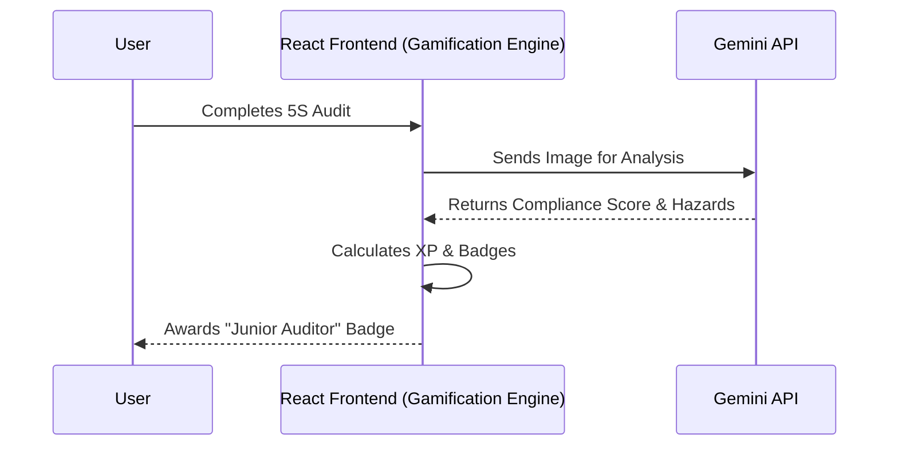

# Lean RPG 🏭✨
> **Gamifying Manufacturing Excellence with AI**


## 🚨 The Problem
Traditional manufacturing training (5S, Safety, Continuous Improvement) is **boring**, **static**, and **disconnected from reality**. Operators nod through slides but fail to apply concepts on the shop floor.

## 🎯 Target User
- **CI Specialists & Plant Managers:** Who need higher engagement and real-time data on shop floor compliance.
- **Operators & Team Leaders:** Who need a fun, interactive way to learn and track their daily improvements.

## 🔑 Key Scenarios
1.  **Onboarding:** New hires find hazards in a virtual AR environment before stepping on the line.
2.  **Daily Gemba:** Managers earn XP for logging valid safety observations during walks.
3.  **Problem Solving:** Teams use the interactive AI-assisted Fishbone diagram to solve root causes.

👉 [**Read Detailed Use Cases**](/docs/USE_CASES.md)

## 🎮 Features
- **AR 5S Scanner:** Uses Gemini Vision to analyze real workplace images.
- **Digital Twin:** Interactive factory map with location-based training.
- **Gamification:** Real-time level progress, badges, and global Hall of Fame.
- **AI Feedback Loop:** Instant grading of your audits by Google Gemini.

## 🚀 Live Demo
Access the latest build here:
**[LINK TO LIVE DEMO - PENDING]**

*Credentials for demo:* `admin / demo123`

---

## 🛠 Architecture Overview
The application is currently a **Client-Side Heavy / Serverless-First** architecture designed for rapid scaling.



## 👩‍💻 For Developers & AI Agents
This repository is structured as an **AI Playground**.
- **[Status & Roadmap](STATUS.md)**
- **[AI Agent Guide](docs/AI_AGENT_GUIDE.md)**

### Quick Start
```bash
npm install
npm run dev
```